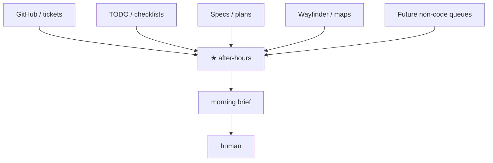

# Composition — after-hours is the loop, not a downstream step

**after-hours-loop** is a **workflow-agnostic AFK orchestrator**. It consumes *any* trackable work surface (issues, TODOs, specs, maps, tickets, future non-code queues), runs unattended ticks A→Z within safe guardrails, and leaves a morning brief.

It is **not** owned by the Matt grill → to-spec → to-tickets pipeline. That chain is one *optional* upstream. When Matt (or any peer) artifacts exist, we **detect and consume** them. When they do not, we still run from explicit Sources.

## Mental model

```text
          any tracker / inbox / plan surface
                        │
                        ▼
              ★ after-hours (AFK loop)
           sources → queue → executors → outcomes
                        │
                        ▼
                 morning brief → human
```

Optional Mermaid:



## Soft vs hard dependencies

**Hard (must be true before AFK):**

- Queue items are **agent-ready** for *this* domain (clear acceptance; no required HITL mid-tick).
- Runtime basics for the chosen executors (e.g. `gh` if opening PRs; writable state).

**Soft (use if present; never require):**

- Matt-style artifacts: `CONTEXT.md`, `docs/adr/`, `docs/agents/issue-tracker.md`, Agent Brief comments, wayfinder maps / tickets.
- Peer tooling (ponytail, implement, tdd, code-review, domain packs): prefer when installed.
- Any other tracking dialect — add a `sources/*.md` adapter; do not fork the orchestrator.

Vague or decision-heavy items → `blocked` (or skip), never invent scope overnight.

## What AHL never does overnight

- Interactive grilling or answering HITL questions on the user's behalf
- Rewriting domain glossaries / ADRs as product ownership (unless a future non-code executor explicitly allows it)
- Inventing product (or domain) decisions
- Requiring a specific upstream workflow to be present

## Coexistence

Install Matt skills (or Linear, Notion, custom inboxes, research packs, …) **alongside** heff. After-hours remains the AFK runner:

1. Daytime: whatever workflow produces agent-ready work.
2. Night: Sources → `/after-hours`.
3. Morning: brief → human.

See [INSTALL.md](../INSTALL.md) and [portability.md](./portability.md).
