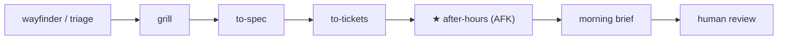

# Composition — where after-hours-loop sits

**after-hours-loop** is the downstream **AFK build phase**. Upstream alignment and ticket shaping belong to [mattpocock/skills](https://github.com/mattpocock/skills) (and similar human/HITL flows). We compose with those skills; we do not replace them.

## Main flow

```text
wayfinder / triage → grill → to-spec → to-tickets → ★ after-hours (AFK) → morning brief → human
```

| Stage | Who | Role |
|-------|-----|------|
| wayfinder / triage | Human + upstream skills | Plan fog, incoming work, labels / briefs |
| grill → to-spec → to-tickets | Human + upstream skills | Align decisions, write specs, cut agent-ready tickets |
| **★ after-hours-loop** | Automation / AFK | Pick ready work, implement, open **draft** PRs |
| morning brief → human | Human | Review PRs, unstick blocked items, grill tomorrow |

Optional Mermaid:



## Soft vs hard dependencies

**Hard (must be true before AFK):**

- Queue items are already **agent-ready** (clear scope, acceptance, safe to implement without new product decisions).
- Runtime basics: `gh` auth, configured repo / base branch / test command, writable session state.

**Soft (use if present; never require):**

- Matt-style artifacts: `CONTEXT.md`, `docs/adr/`, `docs/agents/issue-tracker.md`, Agent Brief comments, wayfinder map.
- Peer tooling (e.g. ponytail, implement, tdd, code-review): prefer when installed; otherwise executor-local steps.
- Upstream skills installed in the same project: detect and honor; fall back to labeled / named Sources only if absent.

Vague or decision-heavy items → `blocked` (or skip), never invent scope overnight.

## What AHL never does overnight

- Interactive grilling or answering HITL wayfinder tickets
- Rewriting `CONTEXT.md` / ADRs as product ownership
- Inventing product decisions or expanding vague tickets into “reasonable” scope
- Shipping merge-ready / unmarked PRs as the default (draft PRs overnight)
- Treating chat-only grill sessions as a file queue (convert via to-spec / tickets **before** AFK)

## Coexistence install

Install Matt skills (or any upstream alignment pack) **and** heff-skills in the same project. Order does not matter; paths do not collide (`skills/after-hours-loop` vs Matt skill names).

Typical pattern:

1. Daytime: wayfinder / grill / to-spec / to-tickets until work is agent-ready.
2. Night: configure Sources (`ready-for-agent`, todo, specs, optional wayfinder-afk) and run `/after-hours`.
3. Morning: read `.cursor/after-hours-morning-brief.md`, review drafts, feed leftovers back upstream.

See [INSTALL.md](https://github.com/jjheffernan/heff-skills/blob/main/INSTALL.md) for heff install paths and [portability.md](https://github.com/jjheffernan/heff-skills/blob/main/docs/portability.md) for Cursor v1 hosts.
